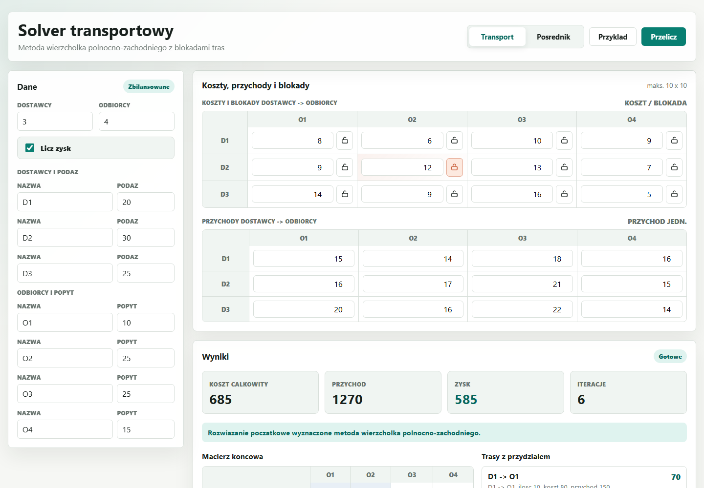
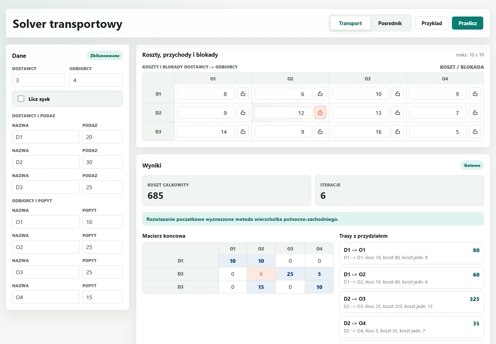

# Solver problemu transportowego

Prosty program do liczenia zadan transportowych. Aplikacja wyznacza plan dostaw
metoda wierzcholka polnocno-zachodniego, pokazuje kolejne kroki na grafach i
pozwala blokowac trasy, ktore nie moga byc uzyte.

Jest tez tryb posrednika. W tym wariancie trasa idzie przez punkt posredni, a
program wybiera najtansze dostepne przejscie dostawca -> posrednik -> odbiorca.

## Co jest w srodku

- backend w Pythonie, bez instalowania dodatkowych paczek,
- edycja dostawcow, odbiorcow, podazy i popytu,
- koszty transportu oraz opcjonalne liczenie przychodu i zysku,
- blokowanie tras w zwyklym problemie transportowym,
- blokowanie odcinkow dostawca-posrednik i posrednik-odbiorca,
- automatyczne bilansowanie przez dostawce albo odbiorce fikcyjnego,
- tabela wyniku koncowego oraz graf dla kazdej iteracji.

## Zrzuty ekranu

Widok z wlaczonym zyskiem:



Widok po wylaczeniu liczenia zysku:



## Uruchomienie

```powershell
python .\backend\server.py --port 8000
```

Jesli Windows nie znajduje polecenia `python`, mozna uzyc launchera:

```powershell
py .\backend\server.py --port 8000
```

Po starcie serwera wejdz w przegladarce na:

```text
http://127.0.0.1:8000
```

## Testy

```powershell
python -m unittest discover -s tests -p "test*.py" -v
```

W srodowisku, w ktorym `python` nie jest w PATH, trzeba podmienic polecenie na
dostepna sciezke do Pythona albo uzyc `py`.
